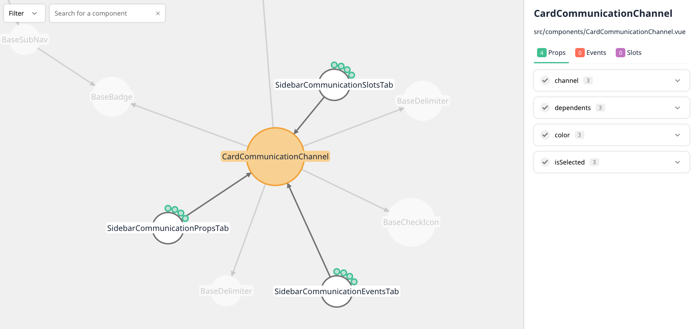

# vuensight 👀
Visualize Vue.js **component relationships** and **communication channels**, i.e. props, events and slots. This tool operates on the 
command line and is made for developers. The aim of vuensight is to provide visual insight into the components of a 
Vue.js project and to support developers before and during refactoring, e.g. by visually analyzing which prop is used 
in which parent component or by highlighting unused components or channels.

An example visualization of vuensight itself:


This tool is built on top of the two awesome packages:
- [dependency-cruiser](https://github.com/sverweij/dependency-cruiser) for building the dependency tree 
- [vue-docgen-api](https://github.com/vue-styleguidist/vue-styleguidist/tree/dev/packages/vue-docgen-api) for parsing the Vue files

## Getting started 🚀
### Install
First install the cli tool locally in the project you want to visualize:
```
npm i -D @vuensight/cli
```

Or globally on your machine if you plan to visualize multiple projects:
```
npm i -g @vuensight/cli
```

### Run in project
Then run the tool in your project folder (local install):
```
npx vuensight
```
or if you installed vuensight globally:
```
vuensight
```


## Options
- `--dir` or `-d` (optional): Specify the directory that should be parsed relative from your current working directory, default is `src`
- `--webpack-config` or `-wpc` (optional): Specify the path to your webpack-config (from your current working directory). This is particularly important if you use aliases.
- `--ts-config` or `-tsc` (optional): Specify the path to your TypeScript config file (from your current working directory).

An example usage:
```
npx vuensight --dir resources/js --webpack-config ./webpack-config.json --ts-config ./tsconfig.json
```

## Licencse
[MIT](LICENSE.txt)


## Development
### Requirements
- `npm version >= 7` (the project is a monorepo and uses npm workspaces which require at least npm version 7)  

### Installing dependencies
- `npm i` (in root directory) to install all dependencies of all packages
- `npm i <package-name>` to add a global dependency for all packages 
- `npm i <package-name> --workspace @vuensight/<vuensight-package-name>` to add a new dependency to a specific package

### Build packages
- `npm run build` in root folder (to build all packages at the same time)
- `npm run build` in each package

### Build watcher
- `npm run build:watch` in every package separately 

### Unit tests
- `npm run test` in root (to run tests for all packages)
- `npm run test` in each package

### Publish
- `npm publish` in each package
